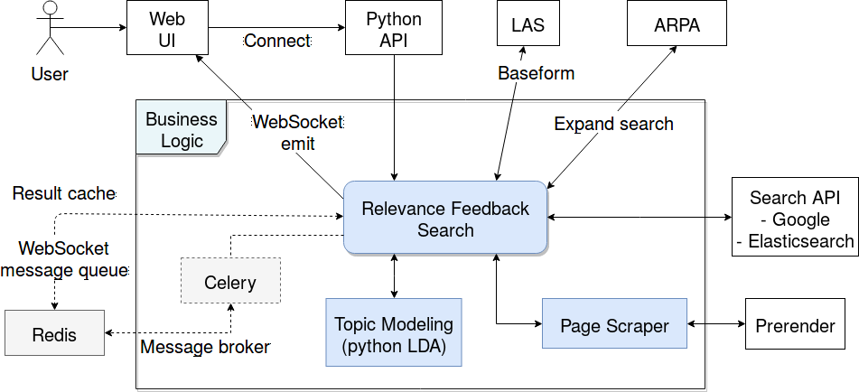

# Toffee -- Topical Relevance Feedback Search

## Requirements

- Hades for news corpus index in elasticsearch: https://github.com/SemanticComputing/hades
    - Elasticsearch uses the Hades `esdata` volume directly if present

## Architecture



## Running the initial training using the news corpus

```
docker-compose -f docker-compose-train.yml up
```

## Running locally

Add a file named `.env` to the repository root with `API_KEY=` and the Google search API key. The `REACT_APP_BACKEND` should point to the `web` service address at the hosting server.

```
docker-compose build --build-arg 'REACT_APP_BACKEND=http://localhost:5000' frontend
docker-compose up -d
```

To deploy with several worker and prerender instances: (for docker version < 3.0)

```
docker-compose build --build-arg 'REACT_APP_BACKEND=http://localhost:5000' frontend
docker-compose up -d
docker-compose scale worker=3 prerender=3
```

 
